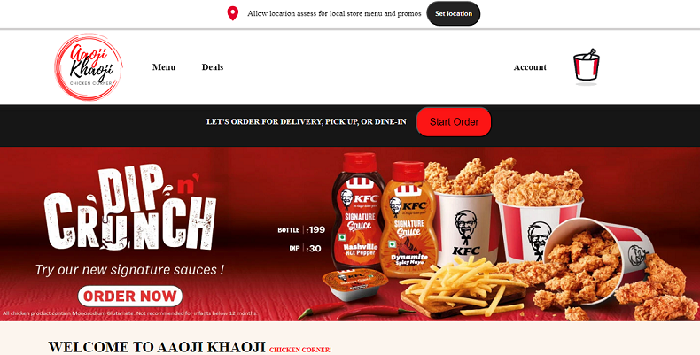

# KFC_Fast_Food_Application
Welcome to the KFC Fast Food Application! This project is a web-based platform inspired by the KFC website, offering users the convenience of ordering delicious fried chicken and other fast-food items. In this repository, we've developed a responsive and user-friendly website with functionalities such as menu checkout, account creation, cart management, and a secure payment process.

<h2>Live Demo Link : "https://luminous-moonbeam-8075ce.netlify.app/">https://luminous-moonbeam-8075ce.netlify.app/</h2>

<h2>Features</h2>
    <ul>
        <li><strong>Menu Checkout:</strong> Explore our menu of mouthwatering fast-food items and easily add them to your order.</li>
        <li><strong>Creating Account:</strong> Sign up to create an account, allowing you to save your order history, preferences, and delivery information.</li>
        <li><strong>Add to Cart:</strong> Select your desired items and add them to your cart for a quick and efficient ordering experience.</li>
        <li><strong>Payment Process:</strong> Experience a secure and hassle-free payment process to complete your order.</li>
        <li><strong>Responsive Design:</strong> Enjoy a consistent and user-friendly experience across various devices, including desktops, tablets, and mobile phones.</li>
    </ul>

<h2>Technologies Used</h2>
    

        <strong>HTML:</strong> Used to structure the content and layout of the website. 
        <strong>CSS:</strong> Styling the website for an appealing and responsive design. 
        <strong>JavaScript:</strong> Adding interactivity and dynamic behavior to enhance user experience. 
        <strong>APIs:</strong> Integration of external services, possibly including payment gateways or other APIs for enhanced functionality. 
        <strong>Local Storage:</strong> Storing user information, preferences, and cart items locally for a seamless user experience.
    

<h2>Installation</h2>
    <ol>
        <li>Clone the repository: <code>git clone </code> https://github.com/Sakshi0704/KFC_Fast_Food_Applicaton</li>
        <li>Navigate to the project directory: <code>KFC_Application</code></li>
        <li>Open the project in your preferred code editor.</li>
        <li>Start a local development server or open the <code>index.html</code> file in your web browser.</li>
    </ol>

<h2>Usage</h2>
    <ol>
        <li>Launch the application by opening the <code>index.html</code> file in your web browser.</li>
        <li>Browse through the menu to find your desired items.</li>
        <li>Add items to your cart by clicking the "Add to Cart" button.</li>
        <li>Create an account to save your information for future orders (optional).</li>
        <li>Proceed to checkout and complete the payment process.</li>
        <li>Enjoy your delicious fast-food order!</li>
    </ol>

<h2>Acknowledgments</h2>
    
We extend our gratitude to the mentors and peers who provided guidance and support during the development of this project from Masai.
 
    
Thank you for visiting the KFC_Fast_Food_Application repository! If you encounter any issues or have suggestions for improvements, feel free to reach out to us through the contact information provided in the repository.

